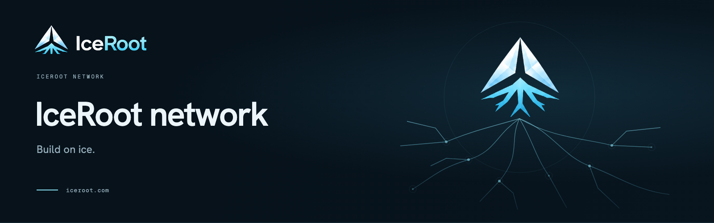

## Build on ice.

IceRoot brings assets, wallets, and validator infrastructure together around one network.

[Website](https://iceroot.com) · [Documentation](https://docs.iceroot.com) · [Explorer](https://scan.iceroot.com) · [Validators](https://validators.iceroot.com)

### Explore IceRoot

| Project | Get started |
| --- | --- |
| [Heartwood Core](https://github.com/iceroot-network/heartwood-core) | [Run a node](https://docs.iceroot.com/core/installation/) |
| [Desktop wallet](https://github.com/iceroot-network/desktop-wallet) | [Desktop guide](https://docs.iceroot.com/wallets/desktop/) |
| [Browser wallet](https://github.com/iceroot-network/browser-wallet) | [Browser guide](https://docs.iceroot.com/wallets/browser/) |
| [Mobile wallet](https://github.com/iceroot-network/mobile-wallet) | [Mobile guide](https://docs.iceroot.com/wallets/mobile/) |
| [Explorer](https://github.com/iceroot-network/explorer) | [Explore the network](https://docs.iceroot.com/network/explorer/) |
| [Validator portal](https://github.com/iceroot-network/validators) | [Create a proposal](https://docs.iceroot.com/validators/proposal/) |

### Make something with IceRoot

Start with the [developer guides](https://docs.iceroot.com/developers/overview/), explore the [API reference](https://docs.iceroot.com/developers/rest-api/), or read the [whitepaper](https://docs.iceroot.com/reference/whitepaper/).

[Brand assets and design system](https://github.com/iceroot-network/mediakit) · [Contributing](https://github.com/iceroot-network/.github/blob/prod/CONTRIBUTING.md) · [Security](https://github.com/iceroot-network/.github/blob/prod/SECURITY.md)
